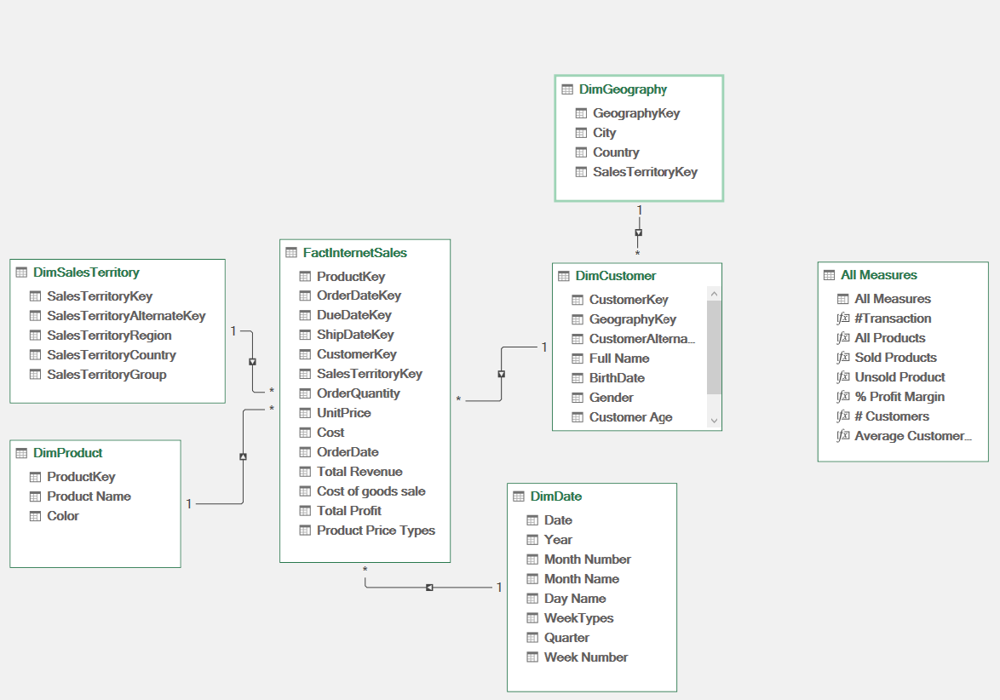
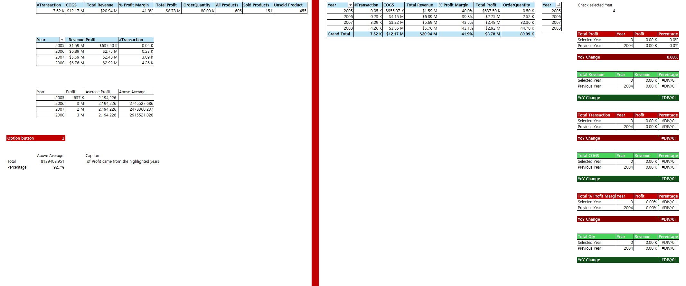
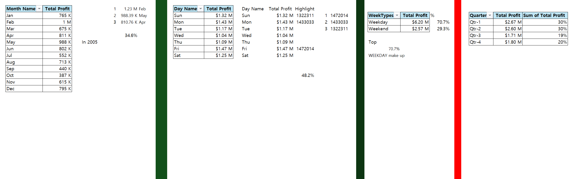
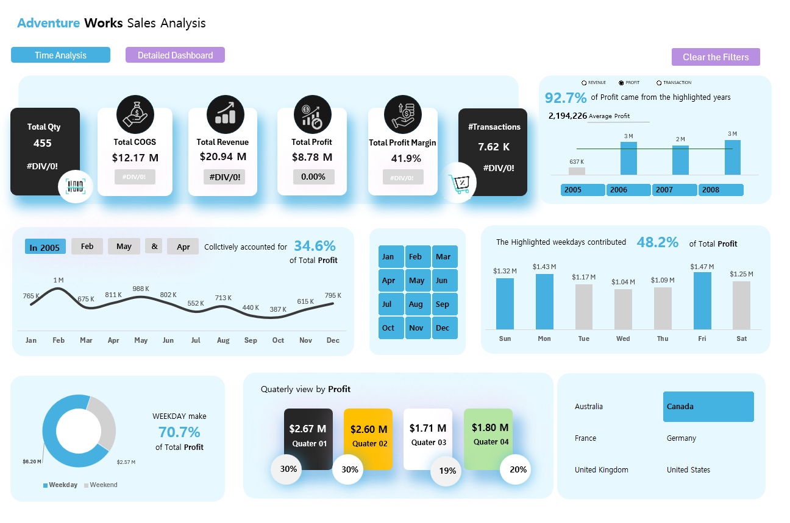
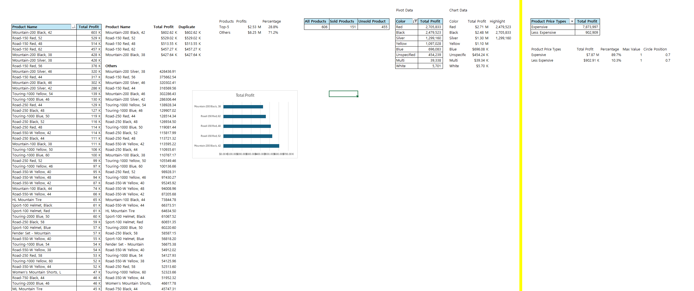
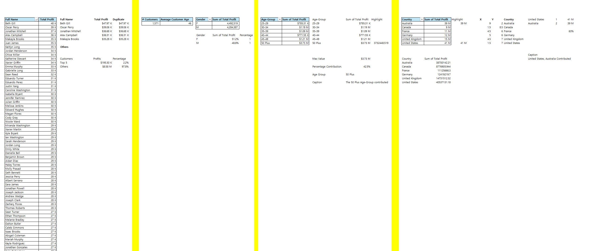
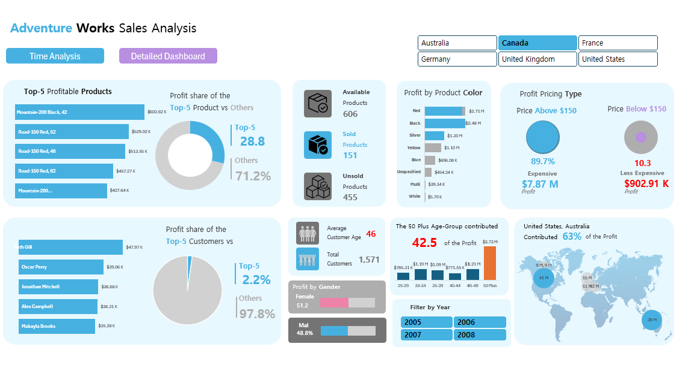

# Adventure-Works-Sales-Excel-Dashboard

## Learning Source!
This project was created by following the YouTube tutorial:  
[AdventureWorks Excel Dashboard Tutorial ;The Microsoft Excel Dashboard Masterclass]([https://www.youtube.com/xxxx](https://youtu.be/VxOOt2dP8Jw?si=N1vrkUiE-4qhg8uH))  

## Overview
This project builds an interactive Excel dashboard using Power Query and Power Pivot with the **AdventureWorks dataset**.  
It provides insights into sales performance, profitability, customer demographics, and product analysis through:  
- Data cleaning and transformation via Power Query  
- Relational data modeling  
- DAX measures and KPIs  
- Interactive dashboards with slicers and filters  

---

## 1. Data Model (Diagram)
The project is powered by a star schema linking fact tables and dimension tables.

---

## 2. Executive Sales Overview (A1)
Provides a high-level summary of sales KPIs, top products, and demographics.

**Key Insights:**
- Top 5 profitable products drive ~29% of total revenue.  
- Customers aged 50+ contribute **42.5% of profit**.  
- Red and black product lines dominate profitability.  

---

## 3. Time-Based Analysis (A2)
Analyzes sales performance over time across years, quarters, and weekdays.

**Key Insights:**
- 2005–2008 contributed **92.7% of profits**.  
- Weekday sales outperform weekends (~71% of profit).  
- Seasonal variation shows Q3 lags compared to Q1 and Q2.  

---

## 4. Main Dashboard
Brings together KPIs, profit distribution, and segment-level breakdown.

---

## 5. Product Analysis (PA)
Product-level profitability by price range, category, and product color.

**Key Insights:**
- Only 151 out of 606 products were sold.  
- Expensive products (>$150) contributed nearly **90% of profit**.  
- Mountain and Road bike series dominate top product rankings.  

---

## 6. Customer & Geography Analysis (CA)
Shows profitability by customer demographics and regional distribution.

**Key Insights:**
- Gender split is nearly even: Female (51.2%), Male (48.8%).  
- U.S. and Australia generate **63% of total profits**.  
- Average customer age: **46 years**.  

---

## 7. Dashboard (Additional View)
Another interactive dashboard layout for detailed filtering and scenario testing.

---

## How to Use
1. Download and open the file: `AdventureWorks-Sales-Dashboard.xlsm`  
2. Enable macros and refresh Power Query connections.  
3. Use slicers and filters for drill-down analysis.  

---

## Files in Repository
- `AdventureWorks-Sales-Dashboard.xlsm` → Main Excel Dashboard  
- `Diagram.png` → Data model schema  
- `A1.png`, `A2.png`, `Main_Dashboard.png` → Main dashboards  
- `pa.png` → Product Analysis  
- `CA.png` → Customer & Geography Analysis  
- `Dashboard_2.png` → Additional dashboard layout  
- `README.md` → Documentation  

---

## Conclusion
This dashboard empowers decision-makers to identify profitable products, key customer segments, and sales trends.  
It demonstrates how **Excel + Power Query + Power Pivot** can deliver BI-level analytics without the need for Power BI.
